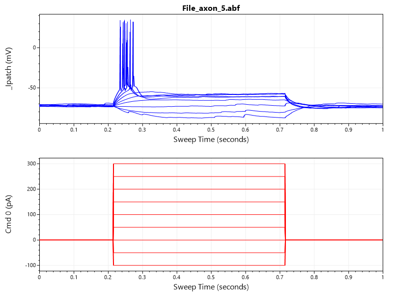

#  AbfSharp
[](https://dev.azure.com/swharden/swharden/_build/latest?definitionId=5&branchName=master)
[](https://www.nuget.org/packages/AbfSharp/)
[](LICENSE)

**AbfSharp is a .NET Standard library for reading electrophysiology data from Axon Binary Format (ABF) files.** 

`AbfSharp.ABF` is a .NET native ABF file reader written entirely in C# so it can be used in 32-bit or 64-bit projects in any environment (including Linux and MacOS).

`AbfSharp.ABFFIO.ABF` has the same API but works by wrapping ABFFIO.DLL (the official closed-source ABF file reading library). Although this DLL can only be used in 32-bit projects that target Windows, this module makes it easy to access to "official" ABF header and sweep data values in .NET environments.

<div align="center">
  
</div>

Consistent with the [Semantic Versioning Specification](https://semver.org), AbfSharp's major version number is zero meaning its API may change as this project continues to evolve.

## Quickstart

### Read ABF Files with C#

```cs
var abf = new AbfSharp.ABFFIO.ABF("demo.abf");
float[] values = abf.GetSweep(42);
for (int i = 0; i < 5; i++)
    Console.Write($"{values[i]}, ");
```

```
-62.469, -62.317, -62.439, -62.439, -62.317,
```

### Plot Sweep Data with C#

[ScottPlot](https://swharden.com/scottplot) can be used to graph sweep data (and stimulus waveforms). See sample source code in the tests folder for a demonstration of how to create plots like this using the latest API:



## DLL Requirements

Although the `AbfSharp.ABF` module can read ABF files on any platform that supports .NET, using the official file reader (ABFFIO.DLL) to extract header and sample data from ABF files with `AbfSharp.ABFFIO.ABF` requires some extra considerations:

* **Your system must have dependencies installed:** The easiest way to ensure you have the DLLs that ABFFIO.DLL depends on is to [**download and install pClamp**]([pCLAMP](https://support.moleculardevices.com/s/article/Axon-pCLAMP-11-Electrophysiology-Data-Acquisition-Analysis-Software-Download-Page)). Attempting to use AbfSharp without these dependencies will produce a runtime error: `Unable to load DLL (Module could not be found HRESULT: 0x8007007E)`

* **Your project must target x86:** ABFFIO.DLL is only available as a 32-bit binary for Windows, and a 64-bit application cannot directly use resources in a 32-bit DLL. Using AbfSharp in an executable built targeting another platform will produce a runtime error: `System.BadImageFormatException: Could not load file or assembly 'AbfSharp, Version=1.0.0.0, Culture=neutral, PublicKeyToken=null'. An attempt was made to load a program with an incorrect format.`

## Resources
* [pyABF](https://swharden.com/pyabf) - a pure-Python interface for ABF files
* [phpABF](https://github.com/swharden/phpABF) - a pure-PHP interface for reading header data from ABF files
* [The ABF File Format](https://swharden.com/pyabf/abf2-file-format/) - extensive documentation about the format of data in binary ABF files
* [ABF-SDK on GitHub](https://github.com/swharden/ABF-SDK) - a collection of code and resources for working with ABF files